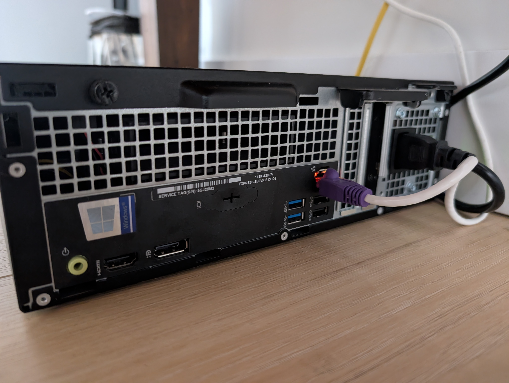

# Arsh's Homelab

Welcome to the documentation for my homelab.  
I started this project as an experiment with a retired Dell OptiPlex desktop on weekend but now it has grown into a dedicated environment for learning Linux system administration, DevOps practices, and self-hosting applications.

---

## Overview

A *homelab* is a personal technology playground. It is a space where you can:

* Learn how servers and networks work
* Test automation, monitoring, and deployment tools
* Host services for yourself, friends, or a small community
* Gain practical experience for IT, system administration, and development roles

  { width="600" }

---

## Hardware

Current setup:
- *Dell OptiPlex (Small Form Factor)*  
  - Intel Core i5 (quad-core)  
  - 16 GB RAM  
  - 500 GB SSD  
- *Networking*: Telus router with mesh boosters for coverage  
- *Access*: Tailscale VPN for private access, Cloudflare Tunnel for secure public access  
- *Switch*: TP-Link unmanaged gigabit switch

---

## Core Features

- *Nginx Proxy Manager* – Reverse proxy with SSL/TLS certificate management  
- *Portainer* – Visual management interface for Docker containers and all apps
- *Cockpit* – Lightweight web UI for Linux server administration  
- *Netdata* – Real-time system monitoring and alerts  
- *Tailscale* – Private mesh VPN for private access  
- *Cloudflare Tunnel* – Secure exposure of services without a static IP  

---

## Software Stack

| Component               | Role                                    |
|--------------------------|-----------------------------------------|
| *Ubuntu Server 24.04* | Base operating system                   |
| *Docker*              | Container runtime                       |
| *Portainer*           | Container management                    |
| *Nginx Proxy Manager* | Reverse proxy and SSL management         |
| *Cockpit*             | Server dashboard                        |
| *Netdata*             | Metrics and monitoring                  |
| *Cloudflare*          | DNS and tunneling                       |
| *Tailscale*           | Private VPN                             |

---

## Getting Started

I made this setup using few simple steps:

1. Install Ubuntu Server.  
2. Configure networking with a static LAN IP using DHCP Reservation.  
3. Install Docker and Portainer for container management.  
4. Deploy Nginx Proxy Manager as the reverse proxy.  
5. Set up Cloudflare DNS and Tunnel to handle domain access.  
6. Use Tailscale for secure private access.  
7. Add monitoring tools like Cockpit and Netdata.  
8. Configure firewall accordingly to maintain secure access.  

Detailed instructions are in the *Installation* section.

---

## Acknowledgements

- The [r/homelab](https://www.reddit.com/r/homelab/wiki/introduction) community  
- The [r/selfhosted](https://wiki.r-selfhosted.com/) community    
- Open-source contributors behind all the tools listed above