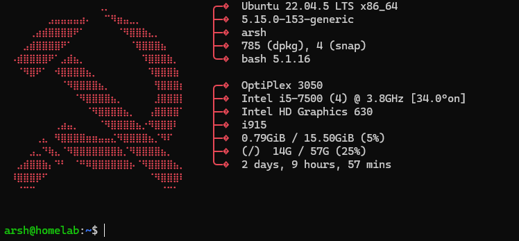
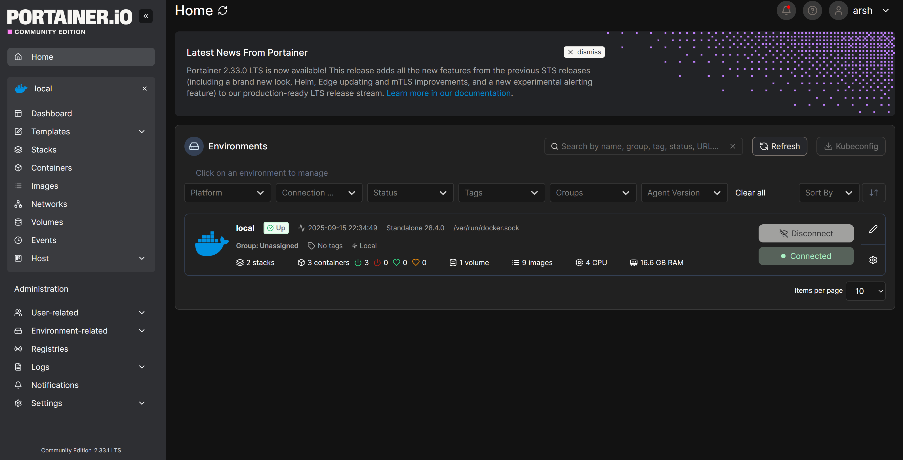
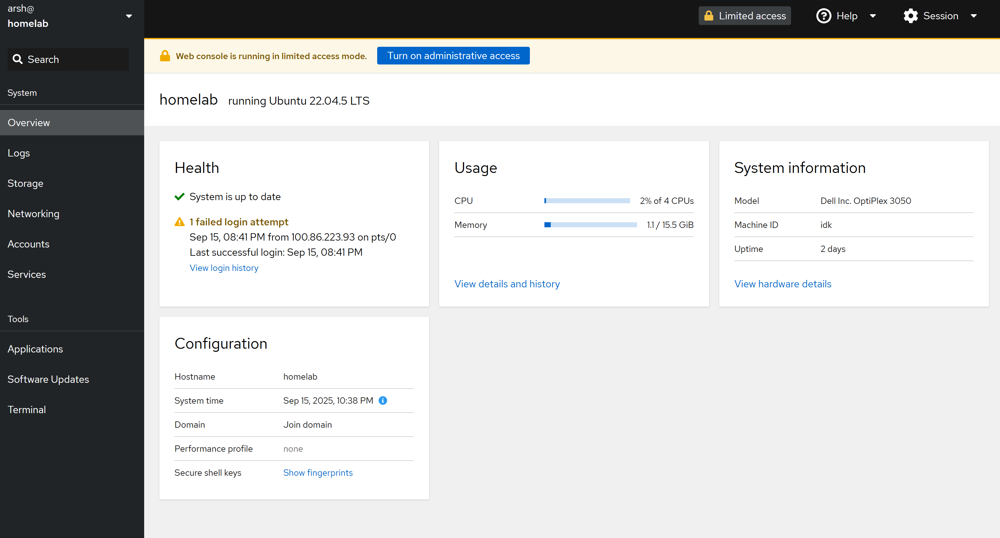
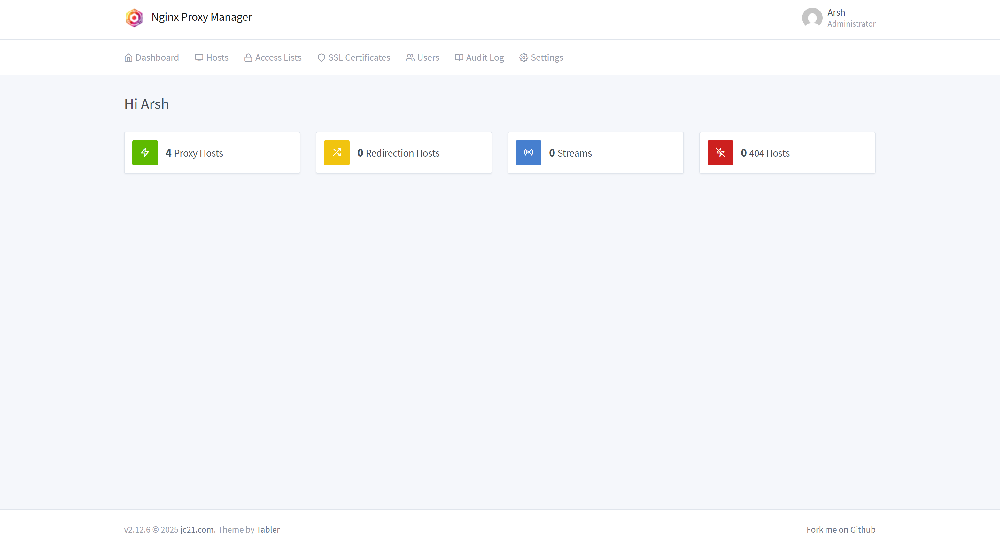
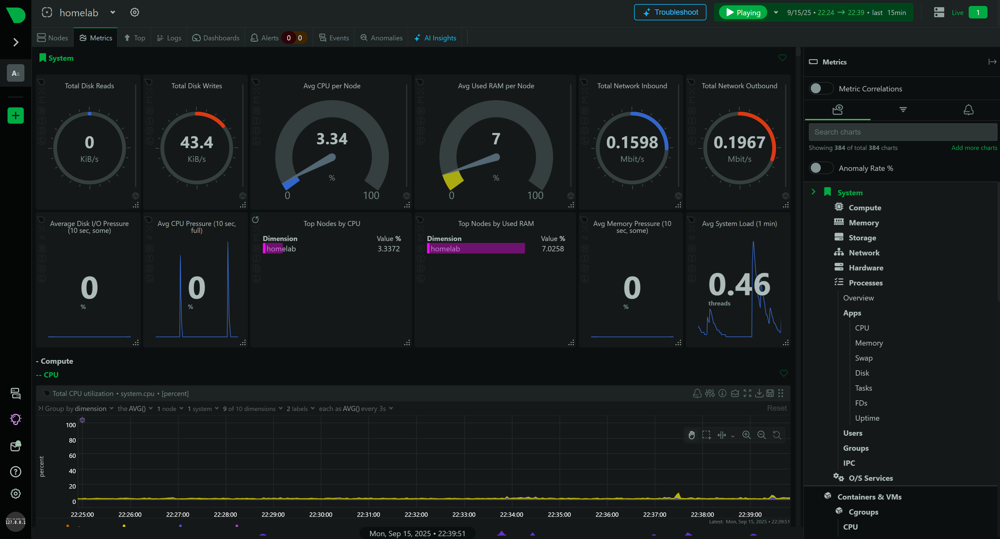

# Tech Stack

Here are the main software and services powering my homelab.  
While setting up my homelab the goal in my mind was to keep things simple but reliable, while leaving space to grow into more advanced setups later.

---

## Base Layer

- **Ubuntu Server 24.04 LTS**  
  I choose it for stability, long-term support, and wide community adoption.  
  Moreover, Server edition also does not have any DE so it runs much more smoothly as we only need to SSH into servers and not actually use it with GUI.

  { width="600" }

- **Docker & Docker Compose**  
  Every service runs inside containers.  
  This makes it very easy to upgrade, move, or rebuild apps.
  Deployment is also very easy using Portainer.

---

## Management & Orchestration

- **Portainer**  
  Web-based Docker management.  
  Makes it simple to spin up and monitor containers with its incredeble web based UI.
  { width="600" }

- **Cockpit**  
  General server manager.  
  Lets me update packages, check logs, and view performance graphs from a browser.
  { width="600" }

- **Nginx Proxy Manager (NPM)**  
  Reverse proxy and SSL certificate manager.  
  It allows all services to run on their own subdomains (e.g., `portainer.itsarsh.dev`, `netdata.itsarsh.dev`).  
  { width="600" }

---

## Networking & Security

- **Cloudflare Tunnel**  
  Exposes my services to the internet securely without opening ports on my ISP router.  
  It also protects against DDoS and adds HTTPS for free.

- **Tailscale**  
  Creates a private mesh VPN between my devices.  
  I use it when I want to SSH or access apps without exposing them to the public web.

- **UFW Firewall**  
  Minimalistic firewall with strict rules to allow only necessary ports (22 via Tailscale, 80/443 for web).

---

## Monitoring & Maintenance

- **Netdata**  
  Real-time monitoring of CPU, RAM, network, and disk usage.  
  I use it to spot unusual activity before it becomes a problem.
  { width="600" }

- **Smartmontools**  
  It keeps an eye on disk health and alerts me if a drive is close to failure.

---

## System Architecture

So, this is how all the apps will work together:

```
                [ Your Devices ]
                      │
               (VPN via Tailscale)
                      │
               ┌──────────────┐
               │Cloudflare DNS│
               └──────────────┘
                      │
            ┌────────────────────┐
            │ Nginx Proxy Manager│
            └────────────────────┘
                      │
    ┌───────────────────────────────────────┐
    │                                       │
    │ [Cockpit]   [Portainer]    [Netdata]  │ 
    │                                       │
    └───────── Docker + Ubuntu Server ──────┘

```